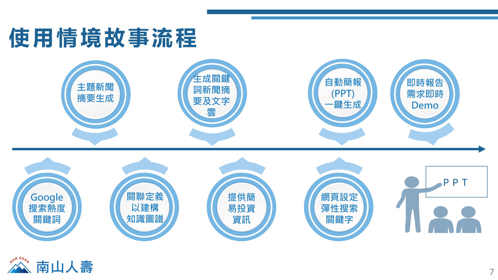

# :moneybag: Fintech X NanShan_2021_Q2(109-2)
> * **課程名稱：**【BDM21301】 雲端運算服務Cloud Computing Service
> * **指導老師：** **_蔡芸琤 Tsai, Yun-Cheng教授_**
---
# :newspaper: 金融科技跨校合作專題：南山人壽（一）
> * **專題名稱：** **【文本生成 - 市場焦點機器人】**
> * **指導教授：** **_石百達 教授 ptshih@ntu.edu.tw_**
> * **專題業師(mentor)：**  
>   * 振坤(Jack)老師    
>   * 振棠(Taylor)老師  
>   * 張明淇 老師 Zuro-MC.Chang@NANSHAN.com.tw
> * **專題說明：** 
>   * 目前市場上的做法 (Why)：  
> 　　投資需關注每日市場狀況。然而，如新聞等文字資訊（特別是中文），大多仍是利用人力進行瀏覽、蒐集、彙整而後製作為焦點報告書。即使有人嘗試以電腦生成，效果仍不盡理想。
>   * 預期解決的痛點 (What)：
>     * 解決隨新聞量劇增所造成之「**人力成本增加**」以及「**分析品質不佳問題**」。  
>     * 自動化生成焦點報告書，提高同仁工作效率。  
>     * 對每日市場新聞進行焦點萃取和動向變化分析，以擴展投資之資訊觸手。
>     * 挑戰中文分析利用斷詞方式所產生的瓶頸，建構通用之中文語意分析框架，以作為其他應用之分析引擎。
>   * 可能的解決方向 (How)：僅提供些許想法，並非要照做。
>     * 利用Google News作為蒐集每日新聞之源頭。
>     * 使用Google Translation進行中文與英文之對照翻譯。
>     * 以英文之模型進行文字解析。

## :chart_with_upwards_trend: 南山人壽（一）【第三組】期末專題
> * **專案名稱：** 【FindTrend】 
> * **成員簡介**
> 
> | 組員  |   學校  |  就讀科系   |   年級  |
> | :------: | :-----: |  :-----:  | :-----: |
> | 邱祥鴻 | 國立臺灣大學 | 財務金融所 | 碩一 |
> | 黃柏森 | 東吳大學 | 資料科學系 | 大二 |
> | 陳星儀 | 東吳大學 | 資料科學系 | 大二 |
> | 洪鈺姍 | 東吳大學 | 企業管理學系 | 延一 |
>
> * **創作理念：**  
>   * 痛點：  
> 　　投資研究員為了尋找好的標的，時時需要接觸並收集大量的新聞、金融、股價等資料，然隨著網際網路日漸發達，所需收集的資料量日漸龐大，但若是再以傳統的人力收集後分析，勢必會耗費大量的時間及成本，造成研究員十分沉重的工作負擔，任務亦日漸艱鉅，以上種種可能會導致工作成效不佳。
>   * 預期解決痛點的效益：  
>       1. 利用機器學習大量收集及整合國內外即時發生的新聞資訊，後可先初步篩選出未來有可能形成新熱門趨勢的議題。
>       2. 研究員可以利用前述初篩選出的資料，進行後續更精密的市場分析等研究報告，並給出迎合趨勢所做出的新投資規劃。
>       3. 提高企業的工作效率，減少許多傳統的人力支出、時間等成本造成的額外負擔。
>       4. 快速整合可以降低投資報告產生的時間，以方便提供給有即時匯報呈現需求的使用者。
>   * 目標：**_快速形成摘要，自動生成PPT。_**
>
### :star2:【FindTrend】專案成果
> * Home：  
>    
>
> * 使用情境流程：
>   
> 　　使用者可以先使用Google搜索熱度的關鍵詞，內含有在美國地區最常被搜尋的關鍵字，並透過自動收集新聞整合內文後，產生以關鍵字為主題的相關新聞摘要以及文字雲，並經由關聯定義建構關鍵字的半自動知識圖譜以生成相關關聯詞，後再將各關聯詞當成關鍵字經由前述的新聞整合收集相關內文以生成獨立的關聯詞摘要，接著透過取得的標的公司的股票代碼取得所提供的簡易投資資訊，最後一鍵自動生成簡報以供使用者有即時報告需求時可以快速使用。
> 
> * Code
> 
> | 項目 | 說明 |   
> | :-----: | :-------- |
> |[app](./FindTrend_Code/app.py)|利用Streamlit建構FinTrend的網頁，並以此作為運行主檔|
> |[craw_url](./FindTrend_Code/craw_url.py)|爬取相關新聞的網頁連結的內文|
> |[gra](./FindTrend_Code/gra.py)|利用networkX繪製半自動的知識圖譜，並生成關聯詞和繪製關聯詞熱度圖|
> |[invest](./FindTrend_Code/invest.py)|爬取1年期公債殖利率，以計算CAPM模型的預期報酬率(股價爬取及整理至於app內)|
> [news](./FindTrend_Code/news.py)|將相關文章進行共線矩陣處理，並整合成摘要|
> [ppt](./FindTrend_Code/ppt.py)|自動生成簡報|
> [rss](./FindTrend_Code/rss.py)|爬蟲Google News的相關新聞並輸出成json|
> [wc](./FindTrend_Code/wc.py)|利用新聞內容生成文字雲|
> 
> * Report
>  
> | 成果 | 說明 |   
> | :-----: | :-------- |
> |[Checkpoint](./project_report/Checkpoint)|04/19、05/10、05/31三次的進度匯報簡報|
> |[PPT](./project_report/Final_Report/【T33】0619-南山-文本機器人_final.pdf)|FindTrend的期末專題簡報|
> |[3分鐘廣告](https://youtu.be/lDfDV1I2Pr4)|06/22：3分鐘的FindTrend期末專題廣告宣傳短影片(含簡易Demo)|
> |[15分鐘PPT匯報](https://youtu.be/P5BRHqQ6Vew)|06/22：15分鐘的FindTrend期末專題完整簡報匯報影片|
